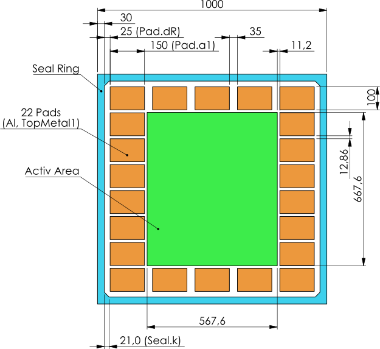

# Self-tought Mixed-Signal On-Chip Temperature Sensor

Welcome 👋

In this repository I host all design-files for my self-tought mixed-signal on-chip temperature sensor.

## Layout



## Tools

I am using the all-in-one docker container [IIC-OSIC-TOOLS](https://github.com/iic-jku/iic-osic-tools) and [IHPs PDK](https://github.com/IHP-GmbH/IHP-Open-PDK) with the [SG13CMOS5L](https://github.com/IHP-GmbH/ihp-sg13cmos5l) process node - which is nativly included in IIC-OSIC-TOOLS as of tag [2026.04](https://github.com/iic-jku/IIC-OSIC-TOOLS/releases/tag/2026.04).

### Pre-Flight Configuration

First, make and cd into a project dir ``~/chipdesignstuff/``:
```shell
mkdir -p ~/chipdesignstuff && cd ~/chipdesignstuff
```

Clone [IIC-OSIC-TOOLS](https://github.com/iic-jku/iic-osic-tools) and this repository:
```shell
git clone https://github.com/iic-jku/IIC-OSIC-TOOLS.git
git clone https://gitlab.com/opdkstuff/octs_testdesign.git
```

💫 Now start the container as instructed with the env variable ``DESIGNS`` pointing to the project repository.

---

> [!note]
> I am running an Arch-based Distro. The following are **quality of live** configurations I've made and are not stricktly necessary.

I am starting an stopping the tools **a lot**. So, for a little more convenience, here are some extra configurations to make life easier.

Make the ``DESIGNS`` environment variable stick and apply on login:

```bash
echo "export DESIGNS="$HOME/chipdesignstuff/octs_testdesign" > "$HOME/.config/fish/config.fish"
```

In order to comfortably start the container from the Start Menu, create a ``.desktop`` entry at ``$HOME/.local/share/applications/chipdesignstuff.desktop`` with the following content:

```
[Desktop Entry]
Categories=Science;Education
Comment=Starts IIC-OSIC Tools docker container containing PDKs like IHPs SG13G2 or Skywaters SKY130 alongside many design tools and simulators like NGspice, Xschem, KLayout.
Exec=bash -c '$HOME/chipdesignstuff/iic-osic-tools/start_x.sh'
GenericName=pdk
Icon=preferences-desktop
Keywords=pdk;docker;asic;chipdesign
Name=OpenPDK Docker Container
NoDisplay=false
Path=
PrefersNonDefaultGPU=false
StartupNotify=true
Terminal=true
TerminalOptions=
Type=Application
X-KDE-SubstituteUID=false
X-KDE-Username=
```