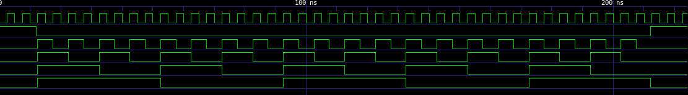

# Digital Flip-Flop Chain

## Basic idea

A toggleish flip-flop divides frequency by 2:

- input clock = `f`
- output clock = `f/2`

Chaining them gives:

```
RO -> buffer -> DFF1 -> DFF2 -> DFF3 -> DFF4
                /2      /4      /8      /16
```

## div16: T-Flipflop Cascade


Compiling/synthesizing the ``div16`` module, inside ``octs_testdesign/digital/div16`` do:
```sh
librelane config.yaml
```

## RTL-level Simulation 

Simulating the testbench using ``iverilog``:
```sh
iverilog -g2012 -o sim/div16_tb.out src/div16.sv src/div16_tb.sv
vvp sim/div16_tb.out
```

> [!IMPORTANT]
> The option ``-g2012`` tells ``iverilog`` to read the input file as SystemVerilog.

This produces the files ``div16_tb.out`` and ``div16_tb.vcd`` inside ``src/`` and prints a truth table to the terminal. Viewing the waveforms with ``GTKWave``:
```sh
gtkwave sim/div16_tb.vcd
```



Looks good!

## Simulation/Integration in ``xschem``

An ``xschem`` symbol is made from the generated ``.spice`` file found inside the ``runs/RUN_*/final/spice/`` dir. The testbench, symbol and ``.spice`` file are found inside ``xschem/``.